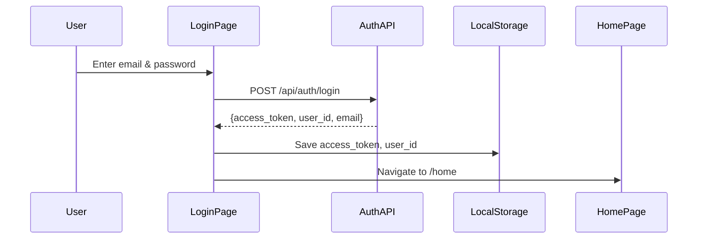
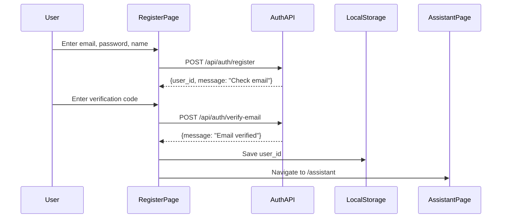
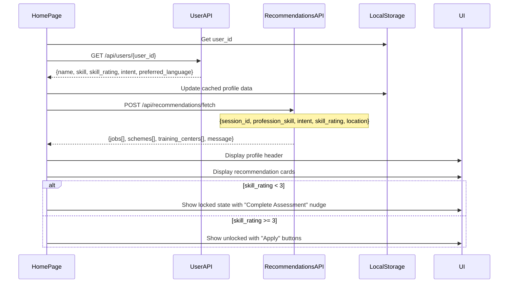
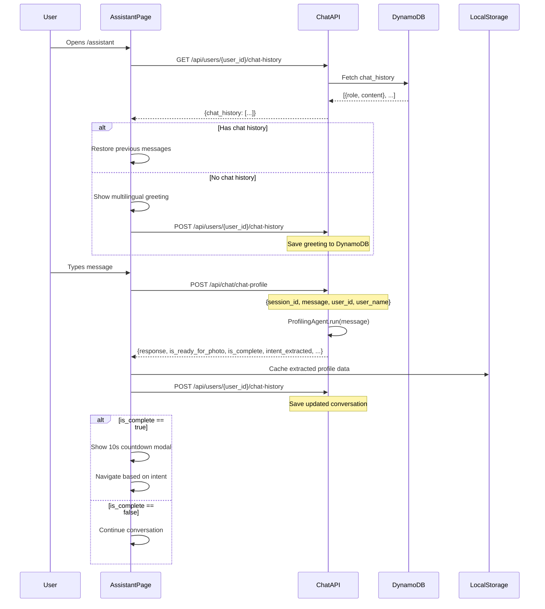
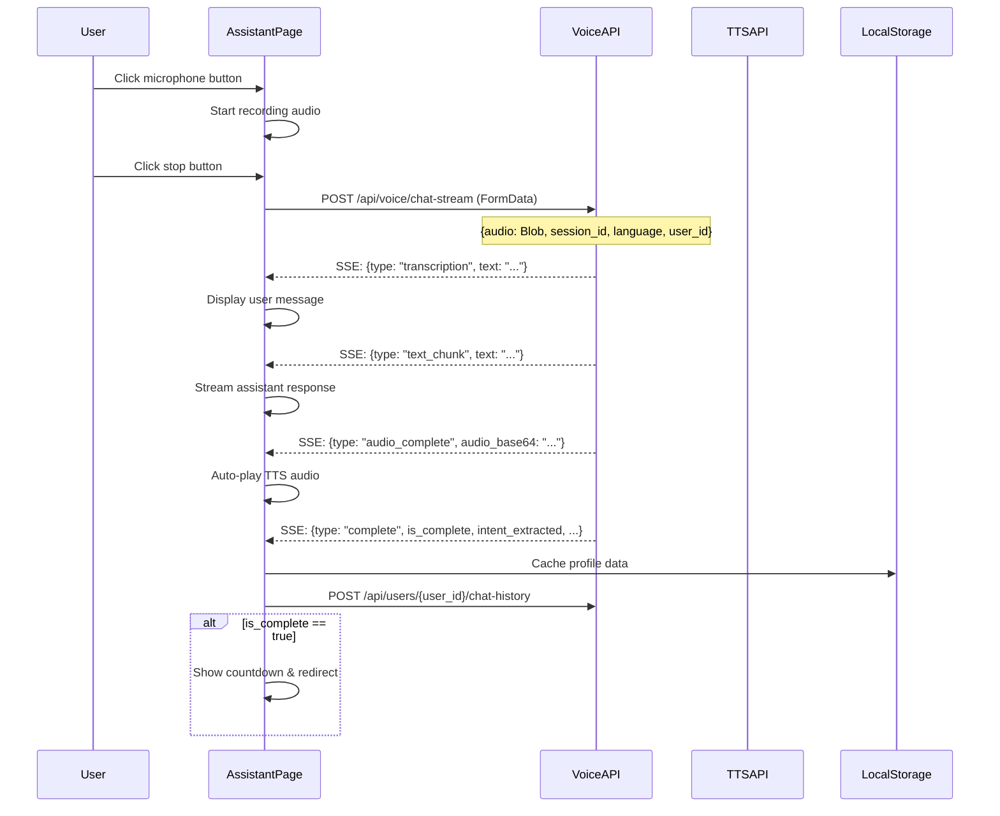
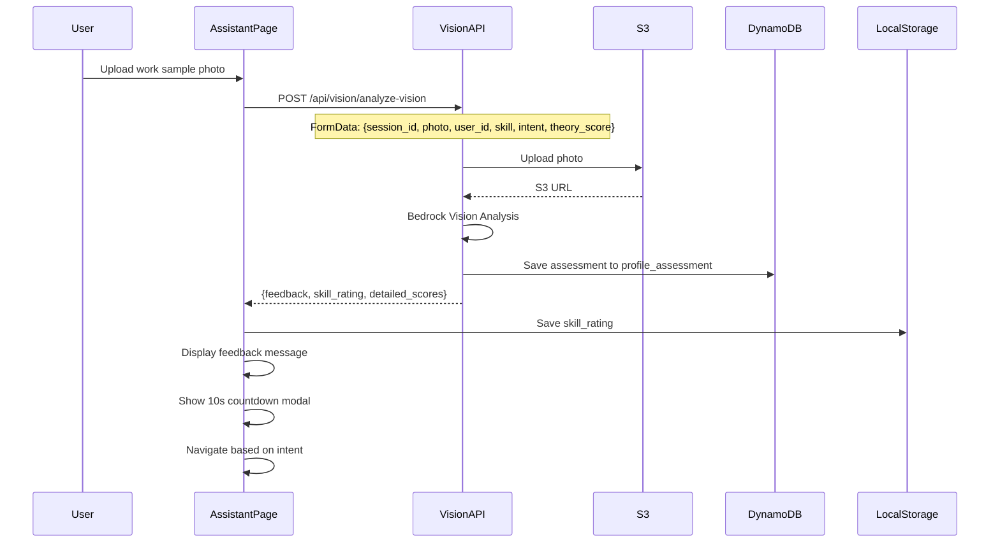
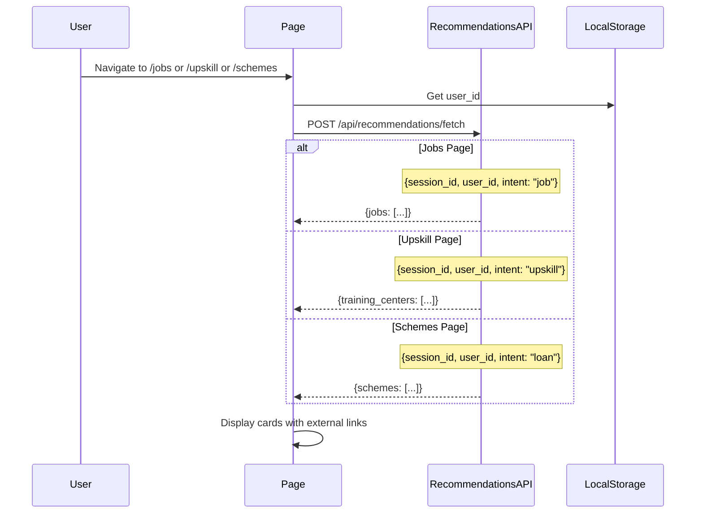
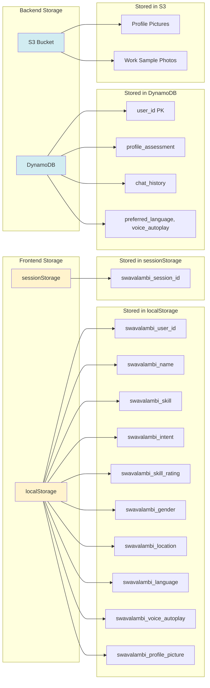
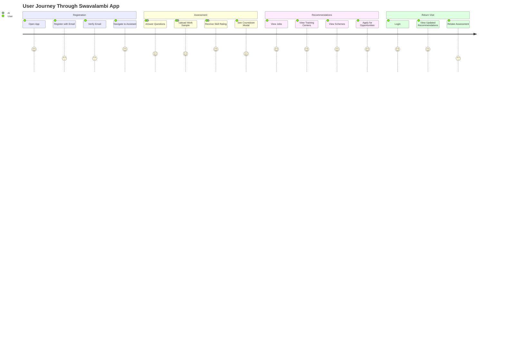

# Swavalambi API Flow Diagram

## Complete System Flow with UI Pages and API Endpoints

```mermaid
graph TB
    subgraph "User Journey"
        START([User Opens App]) --> LOGIN_PAGE[Login Page]
        LOGIN_PAGE --> |New User| REGISTER_PAGE[Register Page]
        LOGIN_PAGE --> |Existing User| HOME_PAGE[Home Page]
        REGISTER_PAGE --> |After Registration| ASSISTANT_PAGE[Assistant Page]
        HOME_PAGE --> |Start Assessment| ASSISTANT_PAGE
        ASSISTANT_PAGE --> |Assessment Complete| REDIRECT{Redirect Based on Intent}
        REDIRECT --> |intent: job| JOBS_PAGE[Jobs Page]
        REDIRECT --> |intent: upskill| UPSKILL_PAGE[Upskill Page]
        REDIRECT --> |intent: loan| HOME_PAGE
        HOME_PAGE --> |View All Jobs| JOBS_PAGE
        HOME_PAGE --> |View Training| UPSKILL_PAGE
        HOME_PAGE --> |View Schemes| SCHEMES_PAGE[Schemes Page]
    end

    subgraph "Login Page APIs"
        LOGIN_PAGE --> API_LOGIN[POST /api/auth/login]
        API_LOGIN --> |Success| SAVE_TOKEN[Save access_token & user_id to localStorage]
        SAVE_TOKEN --> HOME_PAGE
        
        LOGIN_PAGE --> |Forgot Password| API_FORGOT[POST /api/auth/forgot-password]
        API_FORGOT --> API_RESET[POST /api/auth/reset-password]
    end

    subgraph "Register Page APIs"
        REGISTER_PAGE --> API_REGISTER[POST /api/auth/register]
        API_REGISTER --> |Sends verification code| API_VERIFY[POST /api/auth/verify-email]
        API_VERIFY --> |Success| SAVE_USER[Save user_id to localStorage]
        SAVE_USER --> ASSISTANT_PAGE
        
        REGISTER_PAGE --> |Resend Code| API_RESEND[POST /api/auth/resend-code]
    end

    subgraph "Home Page APIs"
        HOME_PAGE --> |On Load| API_GET_USER[GET /api/users/{user_id}]
        API_GET_USER --> |Returns profile| DISPLAY_PROFILE[Display: name, skill, rating, intent]
        
        HOME_PAGE --> |On Load| API_RECOMMENDATIONS[POST /api/recommendations/fetch]
        API_RECOMMENDATIONS --> |Request| REQ_HOME{"{session_id, profession_skill, intent, skill_rating, location}"}
        REQ_HOME --> |Response| RES_HOME["{jobs[], schemes[], training_centers[], message}"]
        RES_HOME --> DISPLAY_CARDS[Display Job/Scheme/Training Cards]
        
        DISPLAY_CARDS --> |skill_rating < 3| LOCKED[Show Locked State]
        DISPLAY_CARDS --> |skill_rating >= 3| UNLOCKED[Show Apply Buttons]
    end

    subgraph "Jobs Page APIs"
        JOBS_PAGE --> |On Load| API_JOBS_REC[POST /api/recommendations/fetch]
        API_JOBS_REC --> |Request| REQ_JOBS{"{session_id, user_id, intent: 'job'}"}
        REQ_JOBS --> |Response| RES_JOBS["{jobs: [...]}"]
        RES_JOBS --> DISPLAY_JOBS[Display Job Cards with Apply Links]
    end

    subgraph "Upskill Page APIs"
        UPSKILL_PAGE --> |On Load| API_UPSKILL_REC[POST /api/recommendations/fetch]
        API_UPSKILL_REC --> |Request| REQ_UPSKILL{"{session_id, user_id, intent: 'upskill'}"}
        REQ_UPSKILL --> |Response| RES_UPSKILL["{training_centers: [...]}"]
        RES_UPSKILL --> DISPLAY_COURSES[Display Training Center Cards]
    end

    subgraph "Schemes Page APIs"
        SCHEMES_PAGE --> |On Load| API_SCHEMES_REC[POST /api/recommendations/fetch]
        API_SCHEMES_REC --> |Request| REQ_SCHEMES{"{session_id, user_id, intent: 'loan'}"}
        REQ_SCHEMES --> |Response| RES_SCHEMES["{schemes: [...]}"]
        RES_SCHEMES --> DISPLAY_SCHEMES[Display Scheme Cards]
    end

    subgraph "Assistant Page - Chat Flow"
        ASSISTANT_PAGE --> |On Load| API_CHAT_HISTORY[GET /api/users/{user_id}/chat-history]
        API_CHAT_HISTORY --> |Returns| CHAT_MSGS["{chat_history: [{role, content}]}"]
        CHAT_MSGS --> |Empty History| SHOW_GREETING[Show Multilingual Greeting]
        CHAT_MSGS --> |Has History| RESTORE_CHAT[Restore Previous Conversation]
        
        ASSISTANT_PAGE --> |User Types Message| CHAT_INPUT[Text Input]
        CHAT_INPUT --> |Streaming Disabled| API_CHAT[POST /api/chat/chat-profile]
        CHAT_INPUT --> |Streaming Enabled| API_CHAT_STREAM[POST /api/chat/chat-profile-stream]
        
        API_CHAT --> |Request| REQ_CHAT{"{session_id, message, user_id, user_name}"}
        REQ_CHAT --> |Response| RES_CHAT["{response, is_ready_for_photo, is_complete, intent_extracted, profession_skill_extracted, theory_score_extracted}"]
        
        API_CHAT_STREAM --> |SSE Stream| STREAM_CHUNKS["data: {chunk: 'text', done: false}"]
        STREAM_CHUNKS --> |Final| STREAM_DONE["data: {done: true, is_complete, intent_extracted, ...}"]
        
        RES_CHAT --> SAVE_CHAT[POST /api/users/{user_id}/chat-history]
        STREAM_DONE --> SAVE_CHAT
        SAVE_CHAT --> CACHE_PROFILE[Cache to localStorage: intent, skill, rating, gender, location]
        
        CACHE_PROFILE --> CHECK_COMPLETE{is_complete?}
        CHECK_COMPLETE --> |true| START_COUNTDOWN[Show 10s Countdown Modal]
        START_COUNTDOWN --> REDIRECT
        CHECK_COMPLETE --> |false| CONTINUE_CHAT[Continue Conversation]
    end

    subgraph "Assistant Page - Voice Flow"
        ASSISTANT_PAGE --> |User Clicks Mic| START_RECORDING[Start Recording Audio]
        START_RECORDING --> |User Stops| STOP_RECORDING[Stop Recording]
        STOP_RECORDING --> |Streaming Disabled| API_VOICE_CHAT[POST /api/voice/chat]
        STOP_RECORDING --> |Streaming Enabled| API_VOICE_STREAM[POST /api/voice/chat-stream]
        
        API_VOICE_CHAT --> |Request| REQ_VOICE{"{audio: Blob, session_id, language, user_id}"}
        REQ_VOICE --> |Response| RES_VOICE["{transcribed_text, response_text, audio_base64, audio_format, is_complete, intent_extracted}"]
        RES_VOICE --> PLAY_AUDIO[Auto-play TTS Audio]
        
        API_VOICE_STREAM --> |SSE Stream| VOICE_EVENTS["Multiple Event Types"]
        VOICE_EVENTS --> EVENT_STT["type: transcription → Show User Message"]
        VOICE_EVENTS --> EVENT_TEXT["type: text_chunk → Stream Response"]
        VOICE_EVENTS --> EVENT_AUDIO["type: audio_complete → Play TTS"]
        VOICE_EVENTS --> EVENT_DONE["type: complete → Save & Check Completion"]
        
        PLAY_AUDIO --> SAVE_CHAT
        EVENT_DONE --> SAVE_CHAT
    end

    subgraph "Assistant Page - Vision Flow"
        ASSISTANT_PAGE --> |User Uploads Photo| SELECT_IMAGE[Select Work Sample Image]
        SELECT_IMAGE --> API_VISION[POST /api/vision/analyze-vision]
        API_VISION --> |Request| REQ_VISION{"{session_id, photo: File, user_id, skill, intent, theory_score}"}
        REQ_VISION --> |Response| RES_VISION["{feedback, skill_rating, detailed_scores}"]
        RES_VISION --> SAVE_RATING[Save skill_rating to localStorage]
        SAVE_RATING --> SHOW_FEEDBACK[Display AI Feedback]
        SHOW_FEEDBACK --> START_COUNTDOWN
    end

    subgraph "Assistant Page - Language & Voice Settings"
        ASSISTANT_PAGE --> |Change Language| LANG_MODAL[Language Selection Modal]
        LANG_MODAL --> |Select Language| API_PREF_LANG[PUT /api/users/{user_id}/preferences?language=hi-IN]
        API_PREF_LANG --> UPDATE_LANG[Update UI Language]
        
        ASSISTANT_PAGE --> |Toggle Voice Auto-play| API_PREF_VOICE[PUT /api/users/{user_id}/preferences?voice_autoplay=true]
        API_PREF_VOICE --> UPDATE_VOICE[Update Voice Setting]
        
        ASSISTANT_PAGE --> |Clear Chat| CONFIRM_CLEAR[Show Confirmation Modal]
        CONFIRM_CLEAR --> |Confirm| API_CLEAR_CHAT[DELETE /api/users/{user_id}/chat-history]
        API_CLEAR_CHAT --> RESET_SESSION[Clear Session & Show New Greeting]
    end

    subgraph "Text-to-Speech Playback"
        SHOW_GREETING --> |voice_autoplay: true| API_TTS[POST /api/voice/synthesize]
        RES_CHAT --> |voice_autoplay: true| API_TTS
        API_TTS --> |Request| REQ_TTS{"{text, language}"}
        REQ_TTS --> |Response| RES_TTS["{audio_base64, audio_format}"]
        RES_TTS --> PLAY_TTS[Play Audio in Browser]
    end

    subgraph "Profile Picture Upload"
        PROFILE_PAGE[Profile Page] --> |Upload Picture| API_UPLOAD_PIC[POST /api/users/{user_id}/profile-picture]
        API_UPLOAD_PIC --> |Request| REQ_PIC{"{file: FormData}"}
        REQ_PIC --> |Response| RES_PIC["{profile_picture_url}"]
        RES_PIC --> SAVE_PIC_URL[Save URL to localStorage]
        
        PROFILE_PAGE --> |Delete Picture| API_DELETE_PIC[DELETE /api/users/{user_id}/profile-picture]
    end

    style START fill:#e1f5e1
    style LOGIN_PAGE fill:#fff3cd
    style REGISTER_PAGE fill:#fff3cd
    style HOME_PAGE fill:#d1ecf1
    style ASSISTANT_PAGE fill:#f8d7da
    style JOBS_PAGE fill:#d1ecf1
    style UPSKILL_PAGE fill:#d1ecf1
    style SCHEMES_PAGE fill:#d1ecf1
    style REDIRECT fill:#ffc107
    style CHECK_COMPLETE fill:#ffc107
```

---

## Detailed API Call Sequences

### 1. Login Flow


### 2. Registration Flow


### 3. Home Page Load Flow


### 4. Assistant Chat Flow (Text)


### 5. Assistant Voice Flow (Streaming)


### 6. Vision Assessment Flow


### 7. Jobs/Upskill/Schemes Page Flow


---

## Data Storage Flow



---

## API Response Time Flow

```mermaid
gantt
    title API Call Timeline (Typical User Journey)
    dateFormat X
    axisFormat %L ms

    section Login
    POST /api/auth/login           :0, 500
    
    section Home Load
    GET /api/users/{user_id}       :500, 300
    POST /api/recommendations/fetch :800, 1200
    
    section Chat Interaction
    POST /api/chat/chat-profile    :2000, 2000
    POST /api/voice/synthesize     :4000, 800
    
    section Vision Assessment
    POST /api/vision/analyze-vision :4800, 3000
    
    section Final Redirect
    Navigate to /jobs              :7800, 100
```



---

## Error Handling Flow

```mermaid
graph TD
    API_CALL[API Call] --> CHECK_RESPONSE{Response OK?}
    CHECK_RESPONSE --> |200 OK| SUCCESS[Process Response]
    CHECK_RESPONSE --> |401 Unauthorized| REDIRECT_LOGIN[Redirect to /login]
    CHECK_RESPONSE --> |404 Not Found| SHOW_404[Show "Not Found" Message]
    CHECK_RESPONSE --> |500 Server Error| SHOW_ERROR[Show "Try Again" Message]
    CHECK_RESPONSE --> |Network Error| SHOW_NETWORK[Show "Check Connection" Message]
    
    SUCCESS --> UPDATE_UI[Update UI]
    SHOW_ERROR --> RETRY_BUTTON[Show Retry Button]
    SHOW_NETWORK --> RETRY_BUTTON
    
    style CHECK_RESPONSE fill:#ffc107
    style REDIRECT_LOGIN fill:#f8d7da
    style SHOW_ERROR fill:#f8d7da
    style SHOW_NETWORK fill:#f8d7da
```

---

## Complete User Journey Map


